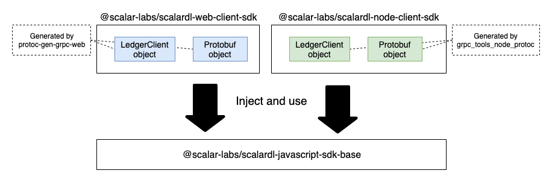

NPM package `@scalar-labs/scalardl-javascript-sdk-base` is the common part for package [@scalar-labs/scalardl-web-client-sdk](https://github.com/scalar-labs/scalardl-web-client-sdk) and [@scalar-labs/scalardl-node-client-sdk](https://github.com/scalar-labs/scalardl-node-client-sdk).
Although those two packages use different gRPC tools to generate the service and the Protobuf objects, they can use @scalar-labs/scalardl-javascript-sdk-base after they inject the objects.

The developers might not really need to use this package. Please reference [@scalar-labs/scalardl-web-client-sdk](https://github.com/scalar-labs/scalardl-web-client-sdk) or [@scalar-labs/scalardl-node-client-sdk](https://github.com/scalar-labs/scalardl-node-client-sdk) to create Scalar DLT applications.
